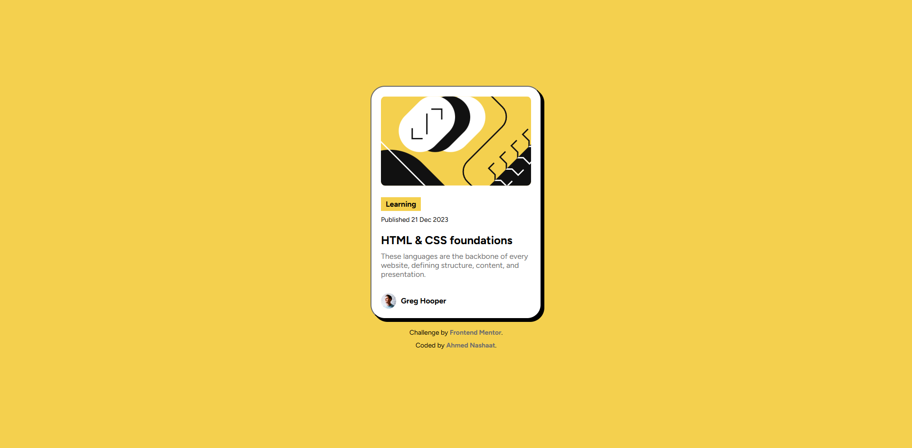

# Frontend Mentor - Blog preview card solution

This is a solution to the [Blog preview card challenge on Frontend Mentor](https://www.frontendmentor.io/challenges/blog-preview-card-ckPaj01IcS). Frontend Mentor challenges help you improve your coding skills by building realistic projects. 

## Table of contents

- [Overview](#overview)
  - [The challenge](#the-challenge)
  - [Screenshot](#screenshot)
- [My process](#my-process)
  - [Built with](#built-with)
  - [What I learned](#what-i-learned)
- [Author](#author)

## Overview

### The challenge

Users should be able to:

- See hover and focus states for all interactive elements on the page

### Screenshot

### Links

- Solution URL: [Github repo](https://github.com/anashaat95/Blog-preview-card)
- Live Site URL: [Live](http://anashaat95.github.io/Blog-preview-card)

## My process

### Built with

- Semantic HTML5 markup
- CSS custom properties
- Flexbox

### What I learned

I was easy to me but it is a good practice. I believe in the power of practice because Practice makes Perfect.

## Author

- Website - Ahmed Nashaat Alnagar (https://www.linkedin.com/in/anashaat95/)
- Frontend Mentor - [@anashaat95](https://www.frontendmentor.io/profile/anashaat95)
- Twitter - [@anashaat95](https://www.twitter.com/anashaat95)
