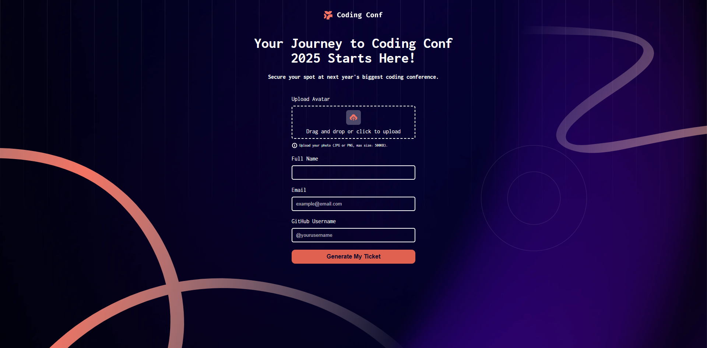

# Frontend Mentor - Conference ticket generator solution

This is a solution to the [Conference ticket generator challenge on Frontend Mentor](https://www.frontendmentor.io/challenges/conference-ticket-generator-oq5gFIU12w). Frontend Mentor challenges help you improve your coding skills by building realistic projects. 

## Table of contents

- [Overview](#overview)
  - [The challenge](#the-challenge)
  - [Screenshot](#screenshot)
- [My process](#my-process)
  - [Built with](#built-with)
  - [What I learned](#what-i-learned)
- [Author](#author)

## Overview

### The challenge

Users should be able to:

- Complete the form with their details
- Receive form validation messages if:
  - Any field is missed
  - The email address is not formatted correctly
  - The avatar upload is too big or the wrong image format
- Complete the form only using their keyboard
- Have inputs, form field hints, and error messages announced on their screen reader
- See the generated conference ticket when they successfully submit the form
- View the optimal layout for the interface depending on their device's screen size
- See hover and focus states for all interactive elements on the page

### Screenshot

### Links

- Solution URL: [Github repo](https://github.com/anashaat95/Conference-Ticket-Generator)
- Live Site URL: [Live](https://conf-ticket-generator.netlify.app/)

## My process

### Built with

- Semantic HTML5 markup
- CSS custom properties
- Flexbox
- Desktop-first workflow

### What I learned

Actually, I learned a lot while building this website using plain HTML, CSS, and JS.
- I learned how to do a drag and drop file uploading.
- I learned how to make a background for the website that consists of different svg files.
- I learned to handle errors during submitting a form.
- I learned to populate the form data inside a another web page.

**I believe in Practice makes Perfect. I learned a lot and I am very ecstatic that I got out of the tutorial hell.

## Author

- Website - [Ahmed Nashaat Alnagar] (https://www.linkedin.com/in/anashaat95/)
- Frontend Mentor - [@anashaat95](https://www.frontendmentor.io/profile/anashaat95)
- Twitter - [@anashaat95](https://www.twitter.com/anashaat95)
