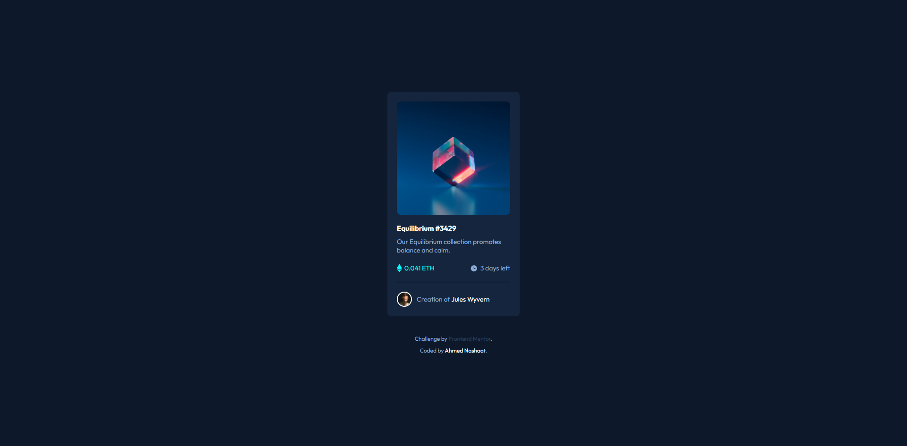

# Frontend Mentor - NFT preview card component solution

This is a solution to the [NFT preview card component challenge on Frontend Mentor](https://www.frontendmentor.io/challenges/nft-preview-card-component-SbdUL_w0U). Frontend Mentor challenges help you improve your coding skills by building realistic projects. 

## Table of contents

- [Overview](#overview)
  - [The challenge](#the-challenge)
  - [Screenshot](#screenshot)
  - [Links](#links)
- [My process](#my-process)
  - [Built with](#built-with)
  - [What I learned](#what-i-learned)
- [Author](#author)

## Overview

### The challenge

Users should be able to:

- View the optimal layout depending on their device's screen size
- See hover states for interactive elements

### Screenshot



### Links

- Solution URL: [Github Repo](https://github.com/anashaat95/NFT-preview-card)
- Live Site URL: [Live](http://anashaat95.github.io/NFT-preview-card)

## My process

### Built with

- Semantic HTML5 markup
- CSS custom properties
- Flexbox
- Desktop-first workflow

### What I learned

I learned a way to put like an icon over an image and make this icon appears on hover.

To see how you can add code snippets, see below:

```html
      <div class="card--image">
        
        <div class="overlay">
          
        </div>
      </div>
```
```css
.card--image {
  border-radius: inherit;
  overflow: hidden;
  cursor: pointer;
  position: relative;
  margin-bottom: 1.6rem;
}

.card--image img {
  width: 100%;
  border-radius: inherit;
}

.card--image .overlay {
  opacity: 0;
  width: 100%;
  position: absolute;
  inset: 0;
  background-color: rgba(0, 255, 247, 0.4);

  display: flex;
  justify-content: center;
  align-items: center;

  transition: opacity 0.3s ease;
}

.overlay .icon {
  color: #fff;
  width: 3.2rem;
  font-weight: 700;
}

.card--image:hover .overlay {
  opacity: 100%;
}
```

## Author

- Website - [Ahmed Nashaat Alnagar](https://www.linkedin.com/in/anashaat95/)
- Frontend Mentor - [@anashaat95](https://www.frontendmentor.io/profile/anashaat95)
- Twitter - [@anashaat95](https://www.twitter.com/anashaat95)
