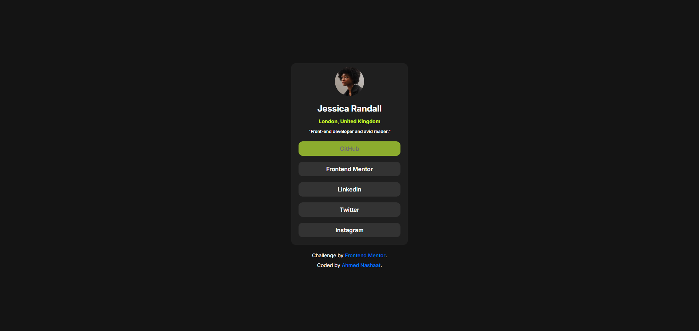

# Frontend Mentor - Social links profile solution

This is a solution to the [Social links profile challenge on Frontend Mentor](https://www.frontendmentor.io/challenges/social-links-profile-UG32l9m6dQ). Frontend Mentor challenges help you improve your coding skills by building realistic projects. 

## Table of contents

- [Overview](#overview)
  - [The challenge](#the-challenge)
  - [Screenshot](#screenshot)
  - [Links](#links)
- [My process](#my-process)
  - [Built with](#built-with)
  - [What I learned](#what-i-learned)
- [Author](#author)

## Overview

This is just a simple challange that shows a card of a user with his profile links. It solved with only HTML and CSS.

### Screenshot

### Links

- Solution URL: (https://github.com/anashaat95/Social-links-profile)
- Live Site URL: (https://anashaat95.github.io/Social-links-profile)

## My process

### Built with

- Semantic HTML5 markup
- CSS custom properties
- Flexbox

### What I learned

Using HTML and CSS more naturally. I am trying to be a master of simple skills and build up on them because practice makes perfect. The whole idea is to get out of the tutorial hell.

## Author

- Website - [Ahmed Nashaat Alnagar](https://www.linkedin.com/in/anashaat95/)
- Frontend Mentor - [@anashaat95](https://www.frontendmentor.io/profile/anashaat95)
- Twitter - [@anashaat95](https://www.twitter.com/anashaat95)
